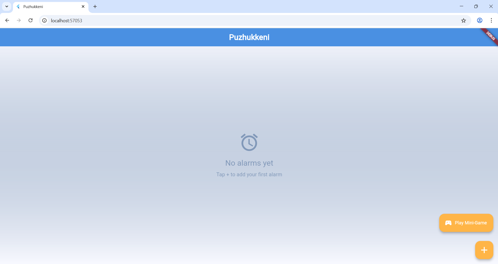
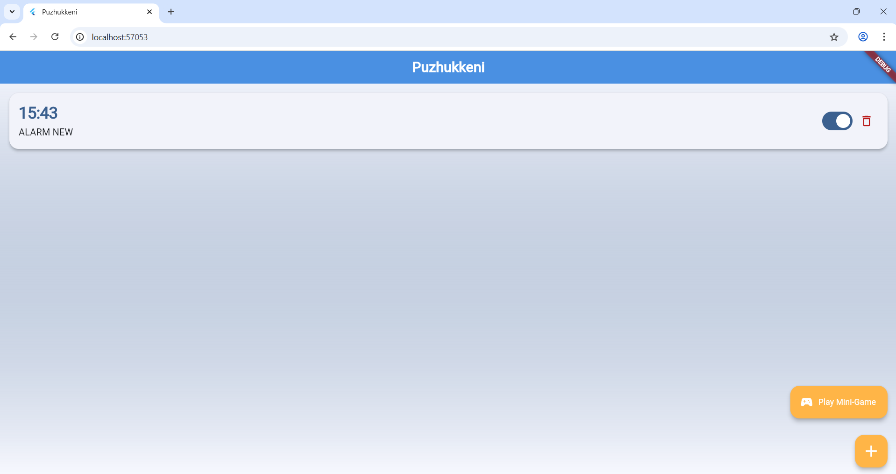
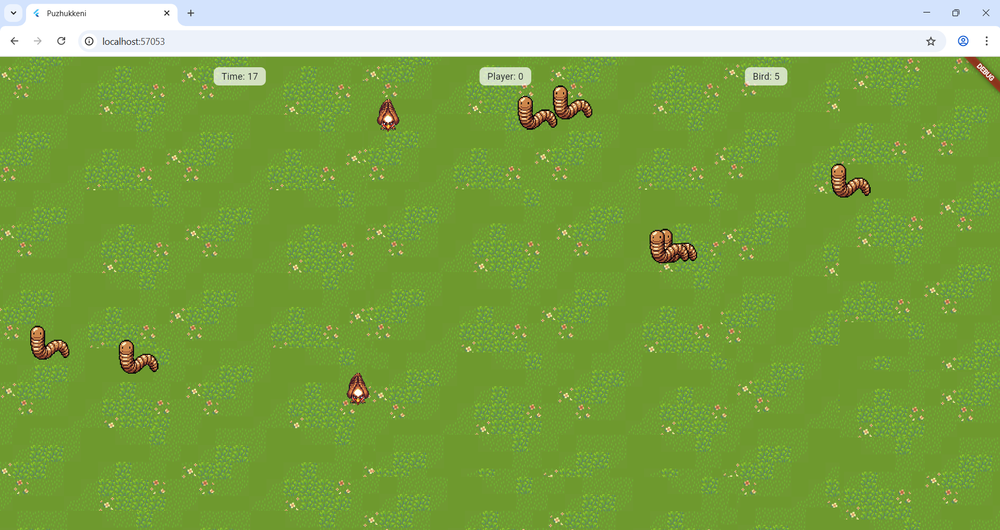

# [Puzhukkeni] 🎯


## Basic Details
### Team Name: [DoubleTrouble]


### Team Members
[Vishnu Nandan] - [Christ College of Engineering]
[Rohan K Sojo] - [Christ College of College]

### Project Description
A completely over-engineered alarm clock where you must win a frantic mini-game to stop the alarm. Wake up by tapping worms before greedy virtual birds snatch them away — every snooze makes the game harder.

### The Problem (that doesn't exist)
People have mastered the art of hitting snooze without even opening their eyes.

### The Solution (that nobody asked for)
You can’t stop the alarm unless you beat the birds in a worm-catching game. The birds get faster each time you snooze. All while a Malayalam uncle roasts you for being lazy.


## Technical Details
### Technologies/Components Used
For Software:
- **Languages used**: Dart
- **Frameworks used**: Flutter (Web)
- **Libraries used**: Flame, audioplayers, provider
- **Tools used**: VS Code, Git, Vercel

For Hardware:
- None

### Implementation
For Software:

# Installation
```bash
git clone https://github.com/rohanks-hub/Puzhukkeni-ULP2.0.git
cd Puzhukkeni-ULP2.0
flutter pub get

# Run
flutter run -d chrome


### Project Documentation
For Software:

## Project Screenshots


*Home screen showing the list of alarms*


*Mini-game in progress with birds chasing worms*



uild*

---
Made with ❤️ at TinkerHub Useless Projects 


